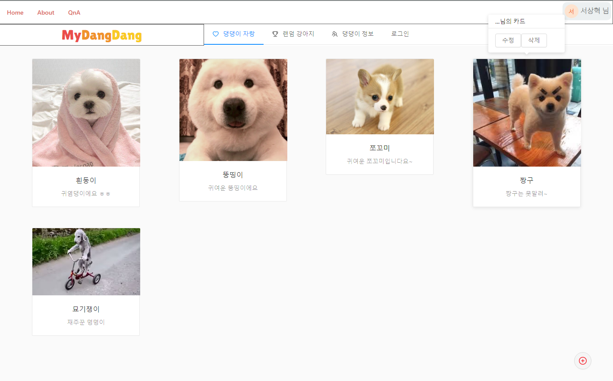
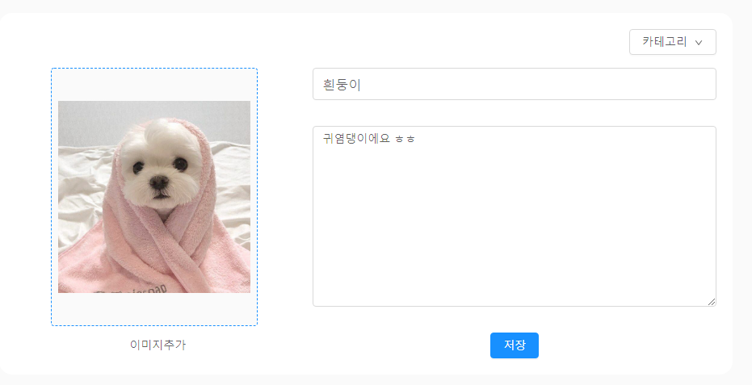
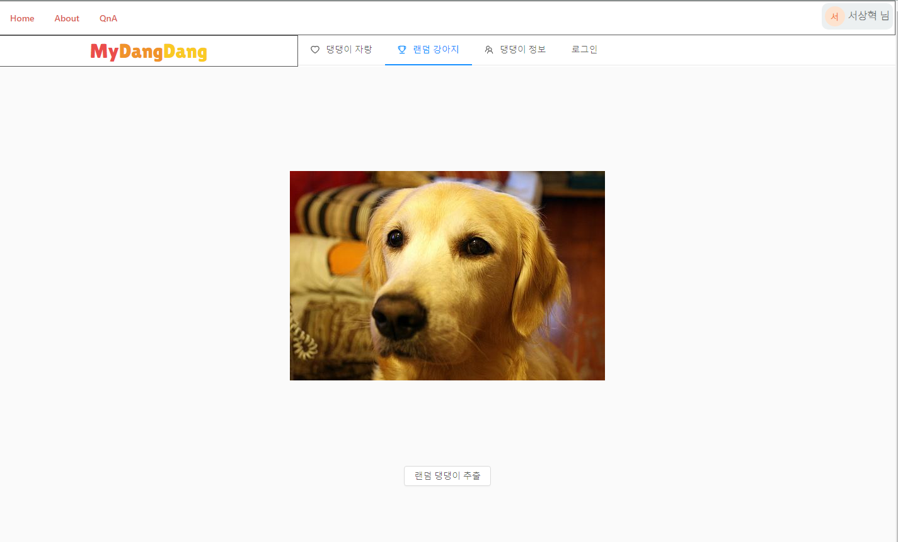

# My DangDang

 

  강아지와의 추억을 모두 함께 나눠요!    
  (Share your Puppy with everyone !)

 

  

  <a href="#boast-puppy">Boast Puppy</a> •
  <a href="#random-dog">Random Dog</a> •
  <a href="#author">Author</a> •
  <a href="#license">License</a>

 

## Key-Features

- 나만의 이쁜 댕댕이를 자랑하고 공유하세요!
- 귀여운 댕댕이들을 구경하세요!
- 랜덤으로 생성되는 댕댕이 사진을 받아가세요!(dog api 이용)
- 댕댕이 상식 퀴즈~! (업데이트 예정)

## Boast-Puppy

## Random-Dog

## Author

- [SeoSang](https://github.com/SeoSang)
- Blog : programming119.tistory.com
- E-mail : (ddrrpg@naver.com)

## License

MIT